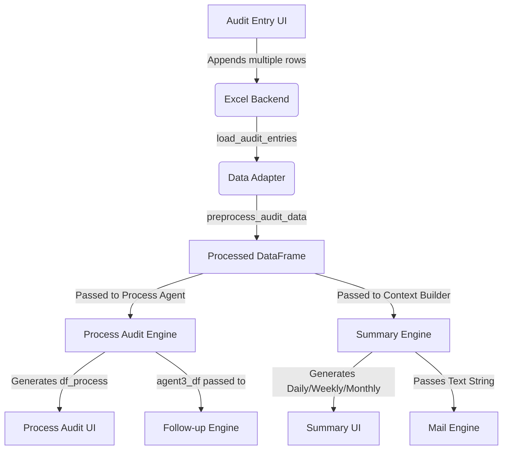

# AutoNQ AI Pipeline Forensic Report
**Topic**: Data Loss Investigation (Single Observation Survival)
**Date**: July 2026

## 1. Complete Pipeline Diagram



## 2. Pipeline Stage Analysis

### Stage 1: Audit Entry to Excel
- **Rows entering:** N
- **Rows leaving:** N
- **Reduction reason:** None. Every distinct observation is safely stored in the `Audit_Entries` sheet.

### Stage 2: Data Loading (`get_audit_df_for_ai`)
- **Rows entering:** N
- **Rows leaving:** N
- **Reduction reason:** None. 

### Stage 3: Data Preprocessing (`preprocess_audit_data`)
- **Function**: `preprocess_audit_data()` in `setup_environment.py`
- **Line Number**: ~187-189
- **Transformation**: `result.drop_duplicates(subset=["line", "station", "observation_text"], keep="last")`
- **Reduction reason**: None for distinct observations. Because the subset includes `observation_text`, differing observations at the same station (e.g. "Oil leakage" and "Dust accumulation") are seen as unique. Only exact duplicates are dropped. **Data survives this stage intact.**

---

## 3. Process Audit Data Loss (Root Cause 1)

### The Exact Point of Data Loss
- **Module Affected**: `setup_environment.py`
- **Function**: `generate_iatf_process_audit_sheet()`
- **Exact Line Numbers**: ~815 to 819
- **Transformation**: 
```python
    top_stations = df_dev_line["station"].value_counts().head(top_n).index.tolist()
    final_rows = []
    for station in top_stations:
        df_station = df_dev_line[df_dev_line["station"] == station]
        top_issue = df_station["observation_text"].value_counts().idxmax()
        # ... appends exactly ONE row to final_rows
```

### Why only the first observation survives
The code iterates through `top_stations` and slices the DataFrame for that specific station (`df_station`). 
It then executes `.value_counts().idxmax()` on the `observation_text` column. This Pandas function calculates the frequency of each observation text and returns **only the index of the most frequent item** (or the very first item if frequencies are tied at 1). 
All other observation strings for that station are completely discarded from memory. The loop then writes precisely one row to the final Process Audit DataFrame.

### Impact Analysis
- **Process Audit UI**: Only displays 1 deviation per station, rendering it incomplete for complex station audits.
- **Follow-up Engine**: The `generate_followup_checklist()` function directly consumes the DataFrame generated by `generate_iatf_process_audit_sheet`. Because the data is already destroyed, the Follow-up checklist is also missing observations.

---

## 4. Summary Engine Data Loss (Root Cause 2)

### The Exact Point of Data Loss
- **Module Affected**: `setup_environment.py`
- **Functions**: `generate_daily_brief()`, `generate_weekly_brief()`, `generate_monthly_brief()`
- **Transformation**: LLM Output Truncation

### Why observations disappear
Unlike the Process Audit, the Summary Engine receives the completely intact `preprocess_audit_data` DataFrame. The `build_context_summary()` function iterates over the DataFrame and correctly formats every single observation into a context string. 
However, the data vanishes during LLM generation because the prompts rigidly enforce a hard mathematical cap on the output:

```text
**Key Observations**
Three bullets. Each bullet: one finding, 5–10 words. One line only.

**Top Recurring Issues**
Two bullets from the data above.
```

If a Line has 4 distinct observations, the LLM is explicitly forbidden from listing them all. It is forced to drop observations to comply with the "Three bullets" rule. 

### Impact Analysis
- **Summary UI**: Displays a maximum of 3 observations, regardless of how many critical issues occurred on the floor.
- **Mail Preview**: `generate_mail_from_summary()` parses the output of the Summary Engine. Because the summary is already artificially truncated, the Mail preview is equally incomplete.

---

## 5. Risk Assessment
**Severity**: CRITICAL
Data is being silently discarded in analytical and reporting outputs. While the backend database (Excel) is preserving the true state of the factory floor, supervisors relying on the Process Audit or Summary Mail are receiving incomplete pictures of plant risk, potentially allowing critical compliance issues (like bypassed interlocks) to go unaddressed simply because they weren't the "first" or "top 3" items processed.

## 6. Recommended Fix Strategy (For Next Phase)
1. **Process Audit**: Refactor `generate_iatf_process_audit_sheet()` to use `.groupby("station")` and iterate over *all* rows in the group, mapping each distinct `observation_text` to its own audit checklist question, rather than using `idxmax()`.
2. **Summary Prompts**: Remove the hard cap of "Three bullets". Instruct the LLM to dynamically generate as many bullets as there are distinct critical issues in the provided context, or group them logically without omitting data.
