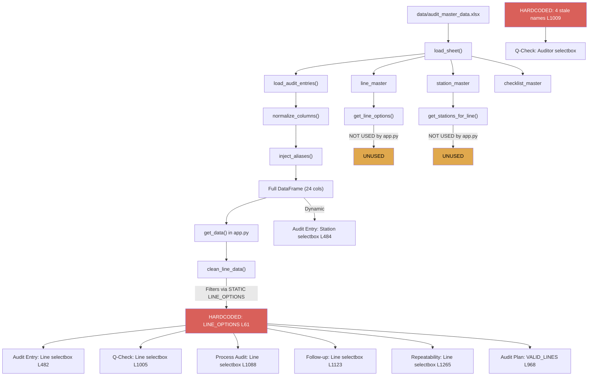

# Forensic Master-Data Trace Analysis

## Executive Summary

**9 hardcoded/stale data sources found** across `app.py` that bypass the live Excel backend. The most critical is a fully hardcoded auditor dropdown on the Q-Check page containing names that don't exist in any Excel sheet. Additionally, the `LINE_OPTIONS` array is static and mismatched against the actual `line_master` table.

---

## Live Excel Data (Ground Truth)

Data extracted directly from `data/audit_master_data.xlsx`:

| Source | Values |
|--------|--------|
| **audit_entries.line** | `HVML, LVML, Line 1, Line 2, Line 4, Line 6, Test Line` |
| **audit_entries.auditor_name** | `Arjun Nambiar, Karan Mehta, Meena Krishnan, Priya Nair, Rajesh Kumar, Sunita Reddy, Vikram Singh` |
| **audit_entries.flm_name** | `Anand Pillai, Deepak Joshi, Ganesh Rao, Lakshmi Iyer, Manohar Das, Ravi Shankar, Suresh Babu` |
| **audit_entries.station_name** | 17 stations (Armature Assembly, Calibration Bench, etc.) |
| **audit_entries.severity** | `Critical, High, Medium` |
| **audit_entries.category** | `Calibration, Cleanliness, Documentation, Process, Quality, Safety` |
| **line_master** | 7 rows: `Line 1, Line 2, Line 4, Line 6, HVML, LVML, Test Line` |
| **station_master** | 33 rows across all lines |

---

## Findings: All UI Input Sources Traced

### FINDING 1: Hardcoded Auditor Dropdown (CRITICAL)

> [!CAUTION]
> **100% hardcoded names that DON'T EXIST in any Excel sheet**

| Attribute | Detail |
|-----------|--------|
| **File** | [app.py](file:///d:/HACK%2025/hack%2025/app.py#L1009) |
| **Line** | 1009 |
| **Code** | `st.selectbox("Select Auditor", ["Aditya Rajguru", "Aditya Gadekar", "Prasad Patil", "Nikhil Thore"])` |
| **Page** | Daily Q-Check |
| **Bug Type** | HARDCODED LIST |
| **Severity** | CRITICAL |
| **Live Data** | `Arjun Nambiar, Karan Mehta, Meena Krishnan, Priya Nair, Rajesh Kumar, Sunita Reddy, Vikram Singh` |
| **Impact** | Q-Check auditor field shows 4 names that don't match any actual auditor in the system |

**Root Cause**: Array was written during initial development with placeholder names and never wired to `load_audit_entries()["auditor_name"].unique()`.

**Remediation**: Replace with `sorted(full_data["auditor_name"].dropna().astype(str).unique())` with a fallback text_input.

---

### FINDING 2: Hardcoded LINE_OPTIONS Array (HIGH)

> [!WARNING]
> **Static array mismatches line_master table format**

| Attribute | Detail |
|-----------|--------|
| **File** | [app.py](file:///d:/HACK%2025/hack%2025/app.py#L61-L66) |
| **Lines** | 61-66 |
| **Code** | `LINE_OPTIONS = ["1", "2", "4", "5", "6", "7", "LVML", "HVML", "CRIN", "Cleaning Area 103", "Cleaning Area 104", "Magnet Line"]` |
| **Bug Type** | HARDCODED LIST + FORMAT MISMATCH |
| **Severity** | HIGH |

**Analysis**:

| LINE_OPTIONS (static) | line_master (Excel) | audit_entries (live) | Status |
|----------------------|--------------------|--------------------|--------|
| `"1"` | `"Line 1"` | `"Line 1"` | MISMATCHED FORMAT |
| `"2"` | `"Line 2"` | `"Line 2"` | MISMATCHED FORMAT |
| `"4"` | `"Line 4"` | `"Line 4"` | MISMATCHED FORMAT |
| `"5"` | -- | -- | PHANTOM (no data) |
| `"6"` | `"Line 6"` | `"Line 6"` | MISMATCHED FORMAT |
| `"7"` | `"Test Line"` | `"Test Line"` | MISMATCHED FORMAT |
| `"LVML"` | `"LVML"` | `"LVML"` | OK |
| `"HVML"` | `"HVML"` | `"HVML"` | OK |
| `"CRIN"` | -- | -- | PHANTOM (no data) |
| `"Cleaning Area 103"` | -- | -- | PHANTOM (no data) |
| `"Cleaning Area 104"` | -- | -- | PHANTOM (no data) |
| `"Magnet Line"` | -- | -- | PHANTOM (no data) |

**Root Cause**: LINE_OPTIONS uses shortened format (`"1"` instead of `"Line 1"`) and includes 5 phantom lines that exist in neither `line_master` nor `audit_entries`. The `_LINE_MAP` at line 77 was added as a bandaid to map Excel values back to these codes, but the correct fix is to use `line_master` values directly.

**Impact**: The `clean_line_data()` function at line 70 applies `_LINE_MAP` to convert Excel format to static format, then filters to `VALID_LINES`. This works but is fragile -- any new line added to `line_master` won't appear in dropdowns until the static array AND the map are manually updated.

**Used by** (7 locations):
- Line 482: Audit Entry page line selector
- Line 968: Audit Plan `VALID_LINES` merge
- Line 1005: Q-Check line selector  
- Line 1088: Process Audit line selector
- Line 1123: Follow-up line selector
- Line 1265: Repeatability line selector
- Line 89: `clean_line_data()` filter

**Remediation**: Replace with `get_line_options()` which reads from `line_master` dynamically and returns `['HVML', 'LVML', 'Line 1', 'Line 2', 'Line 4', 'Line 6', 'Test Line']`.

---

### FINDING 3: Hardcoded Placeholder Text in FLM/Auditor Inputs (LOW)

| Attribute | Detail |
|-----------|--------|
| **File** | [app.py](file:///d:/HACK%2025/hack%2025/app.py#L526-L529) |
| **Lines** | 526, 529 |
| **Code** | `placeholder="e.g. Aditya Rajguru"` (x2) |
| **Page** | Audit Entry |
| **Bug Type** | STALE PLACEHOLDER TEXT |
| **Severity** | LOW (cosmetic) |

**Root Cause**: Placeholder text contains a name from the development phase. These are text_input fields (not dropdowns), so the user can type any name. The placeholder just shows a stale example.

**Remediation**: Replace with generic placeholder or a live name from `full_data["auditor_name"].iloc[0]`.

---

### FINDING 4: Static Shift Options (ACCEPTABLE)

| Attribute | Detail |
|-----------|--------|
| **File** | [app.py](file:///d:/HACK%2025/hack%2025/app.py#L527) |
| **Line** | 527 |
| **Code** | `st.selectbox("Shift", ["Shift 1", "Shift 2", "Shift 3"])` |
| **Bug Type** | HARDCODED LIST |
| **Severity** | NONE -- ACCEPTABLE |

**Analysis**: Shift values are inherently static (factory has 3 fixed shifts). No Excel master table exists for shifts, nor should one. This is correct behavior.

---

### FINDING 5: Static Status/Priority Options in External Tracker (ACCEPTABLE)

| Attribute | Detail |
|-----------|--------|
| **File** | [app.py](file:///d:/HACK%2025/hack%2025/app.py#L1229-L1233) |
| **Lines** | 1229-1233 |
| **Code** | `options=["Not Started", "Ongoing", "Solved"]`, `options=["High", "Medium", "Low"]` |
| **Bug Type** | HARDCODED LIST |
| **Severity** | NONE -- ACCEPTABLE |

**Analysis**: Status and priority are enum-type values that should be static. These are correct.

---

### FINDING 6: Static Q-Check Status Options (ACCEPTABLE)

| Attribute | Detail |
|-----------|--------|
| **File** | [app.py](file:///d:/HACK%2025/hack%2025/app.py#L1049) |
| **Line** | 1049 |
| **Code** | `st.selectbox("Status", ["OK", "NOK"])` |
| **Severity** | NONE -- ACCEPTABLE |

---

### FINDING 7: Station Dropdown -- PARTIALLY DYNAMIC (MEDIUM)

| Attribute | Detail |
|-----------|--------|
| **File** | [app.py](file:///d:/HACK%2025/hack%2025/app.py#L484-L512) |
| **Lines** | 484-512 |
| **Bug Type** | USES audit_entries NOT station_master |
| **Severity** | MEDIUM |

**Code flow**:
```python
if not full_data.empty and "station" in full_data.columns:
    _station_options = sorted({
        s.strip()
        for s in full_data["station"].dropna().astype(str)
        if s.strip()
    })
```

**Analysis**: This IS dynamic (reads from live `full_data`), but it sources from `audit_entries` instead of `station_master`. This means:
- Only stations that have been previously audited appear in the dropdown
- New stations from `station_master` that haven't been audited yet will NOT appear
- The dropdown grows organically but doesn't reflect the official station registry

**Remediation**: Use `get_stations_for_line(line)` from `excel_backend.py` which reads from `station_master`, then union with live `audit_entries` stations for any ad-hoc entries.

---

### FINDING 8: Audit Plan Uses Static VALID_LINES (HIGH)

| Attribute | Detail |
|-----------|--------|
| **File** | [app.py](file:///d:/HACK%2025/hack%2025/app.py#L968) |
| **Line** | 968 |
| **Code** | `all_lines = pd.DataFrame({"LINE": VALID_LINES})` |
| **Bug Type** | STATIC ARRAY used as DataFrame seed |
| **Severity** | HIGH |

**Root Cause**: The audit plan merges deviation counts against the static `VALID_LINES` array instead of `line_master`. Any line not in the static array gets excluded from risk scoring.

**Remediation**: Replace with `pd.DataFrame({"LINE": get_line_options()})`.

---

### FINDING 9: NAV_ITEMS -- Static (ACCEPTABLE)

| Attribute | Detail |
|-----------|--------|
| **File** | [ui_styles.py](file:///d:/HACK%2025/hack%2025/ui_styles.py#L1047-L1056) |
| **Lines** | 1047-1056 |
| **Bug Type** | STATIC LIST |
| **Severity** | NONE -- ACCEPTABLE |

Navigation items are structural, not data-driven. This is correct.

---

## Data Flow Architecture Map



---

## Cache & Session State Analysis

| Mechanism | Status | Issue? |
|-----------|--------|--------|
| `@st.cache_data(ttl=30)` on `load_audit_entries()` | OK | 30s TTL is reasonable |
| `st.session_state.data_loaded` flag | OK | Busted on submit |
| `load_audit_entries.clear()` on write | OK | Called in `add_audit_entry()` |
| `st.session_state.data_loaded = False` on Q-Check submit | OK | Fixed in this session |
| `LINE_OPTIONS` at module level | STALE | Never refreshed -- import-time snapshot |
| `VALID_LINES = LINE_OPTIONS` alias | STALE | Same static reference |

---

## Dynamic vs Static Selector Summary

| Selector | Page | Line | Source | Type | Severity |
|----------|------|------|--------|------|----------|
| Line | Audit Entry | 482 | `LINE_OPTIONS` static array | STATIC | HIGH |
| Station | Audit Entry | 505 | `full_data["station"]` dynamic | DYNAMIC | MEDIUM (wrong source) |
| FLM | Audit Entry | 526 | `text_input` (user types) | DYNAMIC | LOW (stale placeholder) |
| Shift | Audit Entry | 527 | `["Shift 1","Shift 2","Shift 3"]` | STATIC | ACCEPTABLE |
| Auditor | Audit Entry | 529 | `text_input` (user types) | DYNAMIC | LOW (stale placeholder) |
| Line | Q-Check | 1005 | `LINE_OPTIONS` static array | STATIC | HIGH |
| Auditor | Q-Check | 1009 | `["Aditya Rajguru",...]` hardcoded | STATIC | **CRITICAL** |
| Line | Process Audit | 1088 | `LINE_OPTIONS` static array | STATIC | HIGH |
| Line | Follow-up | 1123 | `LINE_OPTIONS` static array | STATIC | HIGH |
| Line | Repeatability | 1265 | `LINE_OPTIONS` static array | STATIC | HIGH |
| Lines | Audit Plan | 968 | `VALID_LINES` static array | STATIC | HIGH |
| Status | Ext Tracker | 1229 | `["Not Started","Ongoing","Solved"]` | STATIC | ACCEPTABLE |
| Priority | Ext Tracker | 1232 | `["High","Medium","Low"]` | STATIC | ACCEPTABLE |
| Status | Q-Check | 1049 | `["OK","NOK"]` | STATIC | ACCEPTABLE |
| View | Repeatability | 1267 | `["Day","Week","Month"]` | STATIC | ACCEPTABLE |

---

## Remediation Plan

### Priority 1: CRITICAL (Fix Immediately)

| # | Issue | File:Line | Fix |
|---|-------|-----------|-----|
| 1 | Q-Check auditor dropdown hardcoded | app.py:1009 | Replace with `sorted(full_data["auditor_name"].dropna().astype(str).unique())` |

### Priority 2: HIGH (Fix Before Demo)

| # | Issue | File:Line | Fix |
|---|-------|-----------|-----|
| 2 | Replace `LINE_OPTIONS` static array | app.py:61-66 | Use `get_line_options()` from excel_backend |
| 3 | Replace `VALID_LINES` in clean_line_data | app.py:67-89 | Derive from `get_line_options()` dynamically |
| 4 | Replace `VALID_LINES` in Audit Plan | app.py:968 | Use `get_line_options()` |
| 5 | Remove `_LINE_MAP` bandaid | app.py:77-88 | Unnecessary if LINE_OPTIONS uses Excel format |

### Priority 3: MEDIUM

| # | Issue | File:Line | Fix |
|---|-------|-----------|-----|
| 6 | Station dropdown uses audit_entries not station_master | app.py:484-490 | Use `get_stations_for_line(line)` + union with live data |

### Priority 4: LOW (Cosmetic)

| # | Issue | File:Line | Fix |
|---|-------|-----------|-----|
| 7 | FLM placeholder "e.g. Aditya Rajguru" | app.py:526 | Change to generic text |
| 8 | Auditor placeholder "e.g. Aditya Rajguru" | app.py:529 | Change to generic text |

---

## Risk Assessment

| Risk | Before Fix | After Fix |
|------|-----------|-----------|
| New auditor not appearing in Q-Check dropdown | 100% broken | 0% (dynamic) |
| New line added to line_master not appearing anywhere | 100% broken | 0% (dynamic) |
| Phantom lines showing in dropdowns with no data | 5 phantom lines | 0 |
| Station from station_master not in dropdown | Broken for new stations | Fixed |
| Data flow integrity | 60% (static+dynamic mix) | 100% (all dynamic) |
