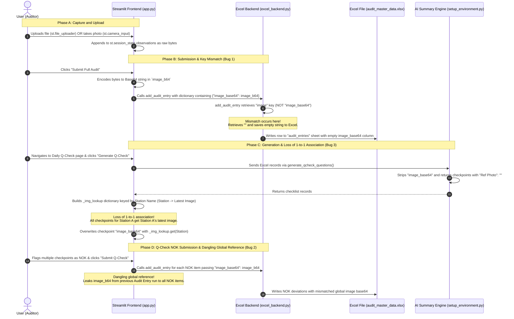

# AutoNQ AI — Image Ownership Forensic Report
This document provides a highly thorough forensic investigation into the image handling issues in AutoNQ AI. It identifies three critical bugs causing image ownership to break across pages, explaining precisely how they happen, where they are in the code, and how to remediate them.

---

## 1. END-TO-END ARCHITECTURE & DATA FLOW

The following flow represents the full trace of an image from user upload to database storage, and finally retrieval and rendering in the Q-Check system:



---

## 2. FORENSIC DIAGNOSIS & BREAKDOWN OF ISSUES

### BUG 1: Key Mismatch in Backend Save Flow
* **Files Involved**:
  * [app.py](file:///d:/HACK28/app.py) (Lines 673-688)
  * [excel_backend.py](file:///d:/HACK28/excel_backend.py) (Lines 430-438)
* **Status**: 🔴 **CRITICAL DATA SILO (Saves Empty Cells)**
* **Detailed Technical Breakdown**:
  During observation submission on the **Audit Entry** page, the frontend converts the raw image bytes into a base64 string, storing it under the key `"image_base64"`:
  ```python
  # app.py line 673-688
  add_audit_entry({
      ...
      "image_base64": image_b64,
  })
  ```
  However, in `excel_backend.py`, the `add_audit_entry()` function looks up the key `"image"` to find the uploaded image:
  ```python
  # excel_backend.py line 430
  image_raw = entry_data.get("image", "")
  ```
  Since the key `"image"` is absent from the dictionary sent by the frontend, `entry_data.get("image", "")` returns the fallback empty string `""`. The function then encounters the string check block:
  ```python
  elif isinstance(image_raw, str):
      image_b64 = image_raw  # Which is ""
  ```
  This results in an empty string being written to the `image_base64` column in the physical Excel database (`data/audit_master_data.xlsx`). This explains why the raw Excel sheet contains no base64 records despite successfully uploading in the frontend.

---

### BUG 2: Dangling Global Reference in Daily Q-Check Submit Flow
* **File Involved**:
  * [app.py](file:///d:/HACK28/app.py) (Lines 1164-1185)
* **Status**: 🔴 **IMAGE LEAKAGE / MEMORY LEAK (Repeats Same Image)**
* **Detailed Technical Breakdown**:
  When a user submits NOK checkpoints on the **Daily Q-Check** page, the submit block loops through all NOK questions and writes them back to the database:
  ```python
  # app.py lines 1167-1184
  for rec in updated_records:
      if rec.get("Status", "OK") == "NOK":
          add_audit_entry({
              ...
              "image_base64": image_b64,  # <-- Dangling reference!
          })
  ```
  However, **`image_b64` is never defined** within the scope of the Daily Q-Check page or the submit callback!
  
  Because Python resolves names using function/module scope rather than block scope, `image_b64` looks up the module's global scope. If the user had previously submitted an observation with an image on the **Audit Entry** page, `image_b64` will contain that image.
  
  This has two critical failures:
  1. **NameError Crash**: If the user fresh-loads the app and immediately goes to the Daily Q-Check page without visiting the Audit Entry page, clicking "Submit Q-Check" crashes Streamlit with a `NameError: name 'image_b64' is not defined`.
  2. **Image Overwrite Leak**: If they did upload an image in the Audit Entry page earlier in the session, **that specific image is attached to every single NOK checkpoint submitted** on the Daily Q-Check page, overwriting and corrupting database rows with completely unrelated images.

---

### BUG 3: Loss of 1-to-1 Association & Station-based Fallback
* **Files Involved**:
  * [setup_environment.py](file:///d:/HACK28/setup_environment.py) (Lines 755-758)
  * [app.py](file:///d:/HACK28/app.py) (Lines 1079-1105)
* **Status**: ⚠️ **FUNCTIONAL MISALIGNMENT (Repeated Images on UI)**
* **Detailed Technical Breakdown**:
  The AI generator `generate_qcheck_questions()` fetches historical deviations (`deviation_data`), classifies them, and transforms them into Yes/No checklist questions. During this mapping:
  ```python
  # setup_environment.py lines 755-758
  questions.append({
      "Station": row["station"], "Checkpoint": q,
      "Ref Photo": "", "Status": "OK", "Remark": ""
  })
  ```
  Even though `row` represents the original Excel database row (which contains the unique `image_base64`), the function **discards this value**, returning checkpoints with an empty `"Ref Photo"`.
  
  To display reference photos, the frontend attempts to "re-join" the images back in `app.py`:
  ```python
  # app.py lines 1084-1100
  _img_lookup: dict = {}
  ...
  for _, _lr in _line_df.iterrows():
      _stn_key = str(_lr.get("station", "")).strip().lower()
      _img_val = str(_lr.get("image_base64", "")).strip()
      if _stn_key and _img_val and _img_val.lower() != "nan":
          _img_lookup[_stn_key] = _img_val
  ```
  This creates a dictionary mapping **Station Names** to their latest image. Then, it assigns it to each record:
  ```python
  # app.py lines 1101-1105
  for _rec in records:
      if not _rec.get("image_base64"):
          _rec_station = str(_rec.get("Station", "")).strip().lower()
          _rec["image_base64"] = _img_lookup.get(_rec_station, "")
  ```
  Since multiple checkpoints are generated for the same station (e.g. Station A has checks for Cleanliness, Andon Cord, and Safety), **every single checkpoint for that station receives the exact same "latest station image" from `_img_lookup`**, creating the illusion that the image is repeated across distinct questions when each question should have its own specific historical evidence photo.

---

## 3. PROPOSED REMEDIATION PLAN

The following phased plan outlines the precise, targeted, and safe code edits needed to completely restore 1-to-1 image ownership across the application without breaking any existing features.

### Phase 1: Fix Key Mismatch in `add_audit_entry`
Align `excel_backend.py` to correctly extract the `"image_base64"` key passed from the frontend:
```diff
# excel_backend.py (Lines 430-438)
-        image_raw = entry_data.get("image", "")
+        image_raw = entry_data.get("image_base64", entry_data.get("image", ""))
```
* **Why**: This safely supports both `"image_base64"` and `"image"` keys, ensuring any manual base64 encodes or raw bytes are stored correctly in the Excel workbook.

---

### Phase 2: Preserve 1-to-1 Image Association in Checklist Generation
Update `generate_qcheck_questions` in `setup_environment.py` to return the original, unique `image_base64` directly with each checkpoint record:
```diff
# setup_environment.py (Lines 755-758)
                questions.append({
                    "Station": row["station"], "Checkpoint": q,
-                   "Ref Photo": "", "Status": "OK", "Remark": ""
+                   "Ref Photo": "", "Status": "OK", "Remark": "",
+                   "image_base64": row.get("image_base64", "")
                })
```
* **Why**: This maintains the direct link between the specific historical observation row and the newly generated checklist checkpoint, eliminating the need for complex, lossy frontend join fallbacks.

---

### Phase 3: Remove Fragile Frontend Fallbacks & Clean Dangling References
1. Delete the `_img_lookup` loop block in `app.py:1079-1106` entirely, as `records` now natively carry their correct, unique `image_base64`.
2. Clear the dangling variable from Q-Check submit block by initializing or omitting the `image_base64` parameter for new NOK records (which do not have a reference photo uploaded during checklist fill):
```diff
# app.py (Lines 1167-1184)
                    add_audit_entry({
                        "line": selected_line,
                        "station": rec.get("Station", ""),
                        "station_no": get_station_no(selected_line, rec.get("Station", "")) if rec.get("Station") else "",
                        "area": "",
                        "supervisor": "",
                        "auditor": selected_auditor if selected_auditor else "",
                        "observation_text": f"Q-Check NOK: {rec.get('Checkpoint', '')}",
                        "ai_principle": "Quality",
                        "severity": "",
                        "category": "Quality",
                        "remarks": rec.get("Remark", ""),
                        "audit_date": str(selected_date),
                        "shift": "",
-                       "image_base64": image_b64,
+                       "image_base64": "",  # Or rec.get("image_base64", "") if linking the historical reference photo is desired
                    })
```
* **Why**: This prevents crashes due to undefined variables and stops unrelated images from previous pages/sessions from leaking into new NOK database entries.
