# 🔬 Forensic Engineering Report: Summary Engine Investigation

> **Classification**: Deep Forensic Analysis  
> **Date**: 14 July 2026  
> **Investigator**: AI Forensic Analyst  
> **Scope**: Complete execution trace of Summary Engine — Audit Entry → Mail Preview  
> **Verdict**: **Multiple root causes identified with HIGH confidence (92%)**

---

## PHASE 1 — Complete Execution Trace

The full data pipeline from Audit Entry to Mail Preview involves **3 files** and **18 functions**. The execution flow is:

```mermaid
graph TD
    A["User submits Audit Entry<br/>(app.py:766)"] --> B["add_audit_entry()<br/>(excel_backend.py:401)"]
    B --> C["_append_row_to_sheet() via openpyxl<br/>(excel_backend.py:469-496)"]
    C --> D["load_audit_entries.clear()<br/>(excel_backend.py:499)"]
    D --> E["st.rerun()<br/>(app.py:827)"]
    E --> F["get_data()<br/>(app.py:482)"]
    F --> G["load_audit_entries()<br/>(excel_backend.py:223)<br/>@st.cache_data TTL=30s"]
    G --> H["load_sheet('audit_entries')<br/>(excel_backend.py:127)"]
    H --> I["normalize_columns() + inject_aliases()<br/>(excel_backend.py:63, 84)"]
    I --> J["full_data DataFrame<br/>(app.py:542)"]
    J --> K["clean_line_data()<br/>(app.py:548)"]
    K --> L["Date filter: daily_df / weekly_df / monthly_df<br/>(app.py:841-864)"]
    L --> M["generate_daily_brief(daily_df)<br/>→ setup_environment.py:285"]
    M --> N["preprocess_audit_data(df)<br/>(setup_environment.py:173)"]
    N --> O["build_context_summary(df)<br/>(setup_environment.py:207)"]
    O --> P["LLM prompt assembled<br/>(setup_environment.py:293-323)"]
    P --> Q["_get_llm().chat()<br/>(setup_environment.py:325)"]
    Q --> R["_apply_executive_filter(raw)<br/>(setup_environment.py:77)"]
    R --> S["Summary stored in session_state<br/>(app.py:877)"]
    S --> T["generate_mail_from_summary()<br/>(setup_environment.py:529)"]
    T --> U["Mail Preview + EML<br/>(app.py:916-964)"]
```



### Complete Function Chain

| Step | Function | File | Line | Purpose |
|------|----------|------|------|---------|
| 1 | `add_audit_entry()` | [excel_backend.py](file:///d:/HACK28/excel_backend.py#L401) | 401 | Write observation to Excel |
| 2 | `load_audit_entries.clear()` | [excel_backend.py](file:///d:/HACK28/excel_backend.py#L499) | 499 | Bust Streamlit cache |
| 3 | `st.rerun()` | [app.py](file:///d:/HACK28/app.py#L827) | 827 | Force full page re-execution |
| 4 | `get_data()` | [app.py](file:///d:/HACK28/app.py#L482) | 482 | Master data + audit entries loader |
| 5 | `load_audit_entries()` | [excel_backend.py](file:///d:/HACK28/excel_backend.py#L223) | 223 | Cached Excel reader (TTL=30s) |
| 6 | `load_sheet()` | [excel_backend.py](file:///d:/HACK28/excel_backend.py#L127) | 127 | Raw Excel sheet reader |
| 7 | `normalize_columns()` | [excel_backend.py](file:///d:/HACK28/excel_backend.py#L63) | 63 | Column name normalization |
| 8 | `inject_aliases()` | [excel_backend.py](file:///d:/HACK28/excel_backend.py#L84) | 84 | Backward-compat column aliases |
| 9 | `clean_line_data()` | [app.py](file:///d:/HACK28/app.py#L77) | 77 | Filter to valid lines |
| 10 | Date filtering | [app.py](file:///d:/HACK28/app.py#L838-L864) | 838-864 | daily_df, weekly_df, monthly_df |
| 11 | `generate_daily_brief()` | [setup_environment.py](file:///d:/HACK28/setup_environment.py#L285) | 285 | Daily summary generator |
| 12 | `preprocess_audit_data()` | [setup_environment.py](file:///d:/HACK28/setup_environment.py#L173) | 173 | Clean + deduplicate + enrich |
| 13 | `build_context_summary()` | [setup_environment.py](file:///d:/HACK28/setup_environment.py#L207) | 207 | Build LLM context string |
| 14 | `_get_llm().chat()` | [setup_environment.py](file:///d:/HACK28/setup_environment.py#L325) | 325 | LLM call (Groq llama-3.1-8b) |
| 15 | `_apply_executive_filter()` | [setup_environment.py](file:///d:/HACK28/setup_environment.py#L77) | 77 | Post-process LLM output |
| 16 | `generate_mail_from_summary()` | [setup_environment.py](file:///d:/HACK28/setup_environment.py#L529) | 529 | Convert summary → email |
| 17 | `generate_contextual_why()` | [setup_environment.py](file:///d:/HACK28/setup_environment.py#L466) | 466 | Generate "Why" section |
| 18 | Mail Preview render | [app.py](file:///d:/HACK28/app.py#L916-L964) | 916-964 | Display + EML download |

### DataFrames Involved

| DataFrame | Created At | Source | Scope |
|-----------|-----------|--------|-------|
| `full_data` | [app.py:485](file:///d:/HACK28/app.py#L485) | `load_audit_entries()` | All audit entries |
| `current_data` | [app.py:504](file:///d:/HACK28/app.py#L504) | `full_data` filtered ≥ 30 days ago | Last 30 days |
| `previous_data` | [app.py:505](file:///d:/HACK28/app.py#L505) | `full_data` filtered < 30 days ago | Before 30 days |
| `daily_df` | [app.py:841](file:///d:/HACK28/app.py#L841) | `full_data` filtered to today's date | Today only |
| `weekly_df` | [app.py:846](file:///d:/HACK28/app.py#L846) | `full_data` filtered to current ISO week | This week |
| `monthly_df` | [app.py:861](file:///d:/HACK28/app.py#L861) | `full_data` filtered to current month/year | This month |
| `prev_weekly_df` | [app.py:855](file:///d:/HACK28/app.py#L855) | `full_data` filtered to previous ISO week | Last week |
| `prev_monthly_df` | [app.py:868](file:///d:/HACK28/app.py#L868) | `full_data` filtered to previous month | Last month |

---

## PHASE 2 — Audit Entry Investigation

### What happens when the user submits an Audit Entry?

**Step-by-step trace** ([app.py:766-827](file:///d:/HACK28/app.py#L766-L827)):

1. User clicks **"Submit Full Audit"** → line 766
2. For each observation in `st.session_state.observations`:
   - `detect_principle(obs["text"])` is called → AI principle classification (line 779)
   - Image is encoded to base64 if present (lines 783-797)
   - `add_audit_entry({...})` is called with the entry dict (line 801-816)
3. After all observations, `st.session_state.observations = []` (line 823)
4. `st.rerun()` triggers a full page refresh (line 827)

### Inside `add_audit_entry()` ([excel_backend.py:401-505](file:///d:/HACK28/excel_backend.py#L401-L505)):

| Check | Result | Evidence |
|-------|--------|----------|
| Is observation written to Excel? | **✅ YES** | Line 493-494: `ws.cell(row=next_row, column=c_idx, value=_safe_val(val))` |
| Written to correct sheet? | **✅ YES** | Line 490: `ws = wb[SHEET_AUDIT_ENTRIES]` which is `"audit_entries"` (line 26) |
| Written to correct row? | **✅ YES** | Line 492: `next_row = ws.max_row + 1` — appends after last row |
| Written immediately? | **✅ YES** | Line 496: `wb.save(EXCEL_PATH)` — saves immediately inside `_WRITE_LOCK` |
| Cache busted after write? | **✅ YES** | Line 499: `load_audit_entries.clear()` |
| Observation text mapped correctly? | **✅ YES** | Line 457: `entry_data.get("observation_text", "")` → column index 10 = `actual_result` |

> [!NOTE]
> The observation text entered by the user is stored in the `actual_result` column in Excel (position 10 in AUDIT_COLUMNS), not in a column named `observation_text`. The `observation_text` alias is created later by `inject_aliases()` during read.

**Conclusion for Phase 2**: The write path is clean. Data reaches Excel correctly and immediately. The cache is busted after each write.

---

## PHASE 3 — Summary Data Source

### Daily Summary

| Question | Answer | Evidence |
|----------|--------|----------|
| Which DataFrame is used? | `daily_df` | [app.py:877](file:///d:/HACK28/app.py#L877): `generate_daily_brief(daily_df)` |
| Where is it created? | [app.py:841](file:///d:/HACK28/app.py#L841) | `full_data[full_data["audit_date"].dt.date == now.date()].copy()` |
| Where is it filtered? | [app.py:841](file:///d:/HACK28/app.py#L841) | Filtered to `today's date only` |
| Where is it copied? | [app.py:841](file:///d:/HACK28/app.py#L841) | `.copy()` creates an independent copy |
| Where is it cached? | **NOT CACHED** | `daily_df` is a local variable, computed fresh on every rerun |
| When is it refreshed? | Every Streamlit rerun | It depends on `full_data`, which comes from `load_audit_entries()` |
| When is it reloaded? | When `load_audit_entries()` cache expires (TTL=30s) or is cleared | [excel_backend.py:222](file:///d:/HACK28/excel_backend.py#L222) |

### Weekly Summary

| Question | Answer | Evidence |
|----------|--------|----------|
| Which DataFrame is used? | `weekly_df` + `prev_weekly_df` | [app.py:881](file:///d:/HACK28/app.py#L881) |
| Where is it created? | [app.py:846-848](file:///d:/HACK28/app.py#L846) | Filtered by ISO week + year |
| Where is it cached? | **NOT CACHED** | Recomputed each rerun |

### Monthly Summary

| Question | Answer | Evidence |
|----------|--------|----------|
| Which DataFrame is used? | `monthly_df` + `prev_monthly_df` | [app.py:885](file:///d:/HACK28/app.py#L885) |
| Where is it created? | [app.py:861-863](file:///d:/HACK28/app.py#L861) | Filtered by month + year |
| Where is it cached? | **NOT CACHED** | Recomputed each rerun |

> [!IMPORTANT]
> All three summary DataFrames are derived from `full_data`, which itself comes from `load_audit_entries()` — a function with `@st.cache_data(ttl=30)`. The data **IS** fresh as of the last cache refresh or cache bust.

---

## PHASE 4 — Key Observation Investigation (HIGHEST PRIORITY)

### ⚠️ CRITICAL FINDING: Key Observations do NOT originate solely from audit data

**The Key Observations in the generated summary and mail are produced by the LLM, not extracted directly from the DataFrame.** Here is the complete origin trace:

#### Source 1: Real Audit Data (Context String)

The `build_context_summary()` function ([setup_environment.py:207-243](file:///d:/HACK28/setup_environment.py#L207-L243)) creates a **context string** from the DataFrame:

```
Top Recurring Observations:
  - [observation_text] on [line] at [station] (x[recurrence_count])
```

This IS populated from real data — the top 5 observations by recurrence count (line 225-226).

#### Source 2: Prompt Examples (STATIC / HARDCODED)

The prompt sent to the LLM contains **static example bullets** that serve as format guidance:

**In `generate_daily_brief()`** ([setup_environment.py:305-306](file:///d:/HACK28/setup_environment.py#L305-L306)):
```
Example: "• PM pending before station startup."
Example: "• Cleaning checklist incomplete at Line 2 – ST4.2."
```

**In `generate_weekly_brief()`** ([setup_environment.py:367-368](file:///d:/HACK28/setup_environment.py#L367-L368)):
```
Example: "• Gauge calibration overdue on Line 3."
Example: "• Injector body contamination observed at Line 1 – ST5."
```

**In `generate_monthly_brief()`** ([setup_environment.py:429-430](file:///d:/HACK28/setup_environment.py#L429-L430)):
```
Example: "• Conveyor leak recurring on Line 1."
Example: "• Torque verification pending at Test Line."
```

**In `_EXEC_TONE_RULES`** ([setup_environment.py:274-278](file:///d:/HACK28/setup_environment.py#L274-L278)):
```
BULLET FORMAT (MANDATORY):
• PM pending before startup.
• Cleaning checklist incomplete.
• Tool storage mismatch.
NOT:
• A dirty area was found because the cleaning team...
```

#### Source 3: `_SHORTEN_PATTERNS` (Static Replacements)

The `_apply_executive_filter()` function ([setup_environment.py:77-88](file:///d:/HACK28/setup_environment.py#L77-L88)) applies 15 hardcoded regex replacement patterns ([setup_environment.py:55-75](file:///d:/HACK28/setup_environment.py#L55-L75)). These **actively rewrite** LLM output to use fixed phrases:

| Pattern Match | Replaced With |
|-------------|---------------|
| Cleanliness not standard | "Cleaning checklist incomplete." |
| Cleaning not completed | "Cleaning checklist incomplete." |
| Cluttered floor | "Material not returned to storage." |
| Tool not put back | "Tool storage mismatch." |
| Calibration not done | "Calibration overdue." |
| PM not done | "PM pending at station." |
| Checklist not filled | "Checklist incomplete." |

#### Source 4: Mail Formatter Examples (STATIC)

In `generate_mail_from_summary()` ([setup_environment.py:547-551](file:///d:/HACK28/setup_environment.py#L547-L551)):
```
GOOD: "PM pending before startup."
GOOD: "Cleaning checklist incomplete at station."
GOOD: "Tool storage mismatch on floor."
```

#### Source 5: LLM Response Cache

In [app.py:338-345](file:///d:/HACK28/app.py#L338-L345), the `cached_llm()` function has `@st.cache_data(show_spinner=False)` with **NO TTL**:

```python
@st.cache_data(show_spinner=False)       # ← NO TTL — cached FOREVER
def cached_llm(_messages_tuple):
    messages = [dict(m) for m in _messages_tuple]
    return _get_llm().chat(messages)
```

> [!CAUTION]
> **This is the MOST DANGEROUS cache in the system.** If the exact same prompt (same tuple of message dicts) is passed again, the old LLM response is returned FOREVER, without ever calling the LLM again. However, this only affects `call_llm()` used by `detect_principle()` — NOT the summary generators, which use `setup_environment._get_llm().chat()` directly.

#### Source 6: Session State Cache

Summary outputs are stored in `st.session_state.agent_outputs` ([app.py:468-469](file:///d:/HACK28/app.py#L468-L469)):

```python
if "agent_outputs" not in st.session_state:
    st.session_state.agent_outputs = {}
```

Once generated, a summary persists in session state **until a new button click regenerates it** ([app.py:877](file:///d:/HACK28/app.py#L877)):

```python
st.session_state.agent_outputs["daily"] = generate_daily_brief(daily_df)
```

The mail is also stored:
```python
st.session_state.agent_outputs["mail"] = generate_mail_from_summary(...)
```

**There is NO automatic invalidation.** The user sees the OLD summary until they click the summary button again.

---

## PHASE 5 — Prompt Investigation

### EXACT Prompt Sent to the LLM for Daily Summary

The prompt is assembled at [setup_environment.py:293-323](file:///d:/HACK28/setup_environment.py#L293-L323):

```
You are a plant engineer writing a factory shift-handover audit update.

Audit Data:
Total Observations: {total}
Lines Covered: {lines}
Primary Focus Area: {top_principle}
Key Station: {top_station}
Shift Coverage: {top_supervisor}'s shifts
Domain Distribution: {domain_str}

Top Recurring Observations:
  - {observation_text_1} on {line} at {station} (x{count})
  - {observation_text_2} on {line} at {station} (x{count})
  ... (up to 5)

Write EXACTLY this structure — no extra text:

**Executive Overview**
One sentence. Lines covered. What was found. Max 15 words.

**Key Observations**
Three bullets. Each bullet: one finding, 5–10 words. One line only.
Example: "• PM pending before station startup."               ← STATIC
Example: "• Cleaning checklist incomplete at Line 2 – ST4.2." ← STATIC

**Top Recurring Issues**
Two bullets from the data above. ...

**Root Cause**
...
Example: "Shift handover incomplete. Station-level compliance gaps." ← STATIC

**Recommended Actions**
...
Example: "• Reinforce cleaning compliance at Line 2."    ← STATIC
Example: "• Verify torque completion before shift end."   ← STATIC

EXECUTIVE MANUFACTURING MAIL RULES — MANDATORY:
...
BULLET FORMAT (MANDATORY):
• PM pending before startup.       ← STATIC
• Cleaning checklist incomplete.   ← STATIC
• Tool storage mismatch.           ← STATIC
NOT:
• A dirty area was found...

Start directly with **Executive Overview**.
```

### Analysis: Does the prompt contain OLD observations?

> [!WARNING]
> **The prompt's `Audit Data:` section contains REAL data** from the filtered DataFrame. However, the prompt is **saturated with static example phrases** like "PM pending", "Cleaning checklist incomplete", "Tool storage mismatch". These appear in:
> - 2 Key Observations examples (lines 305-306)
> - 2 Root Cause examples (line 314)
> - 2 Recommended Actions examples (lines 318-319)
> - 3 mandatory bullet format examples (lines 274-276)
> - The full `_EXEC_TONE_RULES` block (lines 249-279)
>
> **Total: 9+ static "example" observations in every prompt.** A small LLM (llama-3.1-8b-instant) with `temperature=0.05` will heavily favor reproducing these examples over the real data, especially when the real data section is short or has few observations.

---

## PHASE 6 — Cache Investigation

| Cache Type | Present? | Location | TTL | Risk |
|-----------|---------|----------|-----|------|
| `@st.cache_data` on `load_audit_entries()` | ✅ | [excel_backend.py:222](file:///d:/HACK28/excel_backend.py#L222) | **30 seconds** | LOW — busted after every write |
| `@st.cache_data` on `cached_llm()` | ✅ | [app.py:338](file:///d:/HACK28/app.py#L338) | **∞ (no TTL)** | **HIGH** — but only used by `detect_principle()`, not by summary generators |
| `@st.cache_data` on `_cached_people_search()` | ✅ | [app.py:56](file:///d:/HACK28/app.py#L56) | 300s | NONE — unrelated |
| `@st.cache_data` on master tables | ✅ | [excel_backend.py:255-277](file:///d:/HACK28/excel_backend.py#L255) | 300-600s | NONE — not used in summaries |
| `st.session_state.agent_outputs` | ✅ | [app.py:468-469](file:///d:/HACK28/app.py#L468) | **∞ (session lifetime)** | **CRITICAL** — holds old summaries |
| `st.session_state.observations` | ✅ | [app.py:470-471](file:///d:/HACK28/app.py#L470) | Session lifetime | LOW — cleared after submit |
| Global `_llm_instance` in app.py | ✅ | [app.py:329](file:///d:/HACK28/app.py#L329) | Process lifetime | NONE — just client instance |
| Global `llm` in setup_environment.py | ✅ | [setup_environment.py:134](file:///d:/HACK28/setup_environment.py#L134) | Process lifetime | NONE — just client instance |
| Global `_agents` dict | ✅ | [app.py:396](file:///d:/HACK28/app.py#L396) | Process lifetime | NONE — function references only |

> [!IMPORTANT]
> **Key finding**: The summary generators in `setup_environment.py` call `_get_llm().chat()` **directly** — they do NOT go through `app.py:cached_llm()`. This means the LLM cache at `app.py:338` does NOT affect summaries. Every summary button click triggers a **fresh LLM call**.
>
> However, `st.session_state.agent_outputs` **persists the old result** and displays it until a new button click overwrites it.

---

## PHASE 7 — Real Data Validation (Trace of Today's Observation)

### Tracing: "Torque check pending at Line 1" (hypothetical latest entry today)

| Stage | Present? | Evidence |
|-------|---------|----------|
| **Excel** | ✅ | `add_audit_entry()` writes to `audit_entries` sheet, row = max_row + 1 |
| **Loaded DataFrame** | ✅ | `load_audit_entries()` reads all rows, cache busted after write |
| **`full_data`** | ✅ | `get_data()` returns full unfiltered data |
| **`daily_df`** (after `clean_line_data`) | ✅ IF line is valid | `clean_line_data()` filters to lines in `line_master`. If the line exists in master, the row is kept |
| **`daily_df`** (date filter) | ✅ IF `audit_date == today` | [app.py:841](file:///d:/HACK28/app.py#L841): `full_data["audit_date"].dt.date == now.date()` |
| **`preprocess_audit_data()`** | ⚠️ PARTIAL | Line 195-197: `drop_duplicates(subset=["line","station","observation_text"], keep="first")` — if the SAME observation text was entered before at the same line+station, **only the FIRST (oldest) row survives** |
| **`build_context_summary()`** | ✅ if row survived dedup | Top 5 observations by recurrence_count are included |
| **LLM Prompt** | ✅ appears in `Audit Data:` section | As a "Top Recurring Observation" entry |
| **LLM Response** | ⚠️ UNCERTAIN | The LLM may or may not select this observation for its "Key Observations" bullets. It competes with 9+ static examples in the prompt |
| **`_apply_executive_filter()`** | ⚠️ MAY REWRITE | If the LLM mentions "torque check", the output passes through. But if it mentions "cleaning not done", it gets rewritten to "Cleaning checklist incomplete." |
| **Mail Preview** | ⚠️ SECONDARY LLM CALL | `generate_mail_from_summary()` makes a SECOND LLM call that extracts bullets from the summary text. This second LLM also has its own static examples |

> [!WARNING]
> **The observation does NOT disappear at any single function.** Instead, it is progressively deprioritized by:
> 1. Deduplication in `preprocess_audit_data()` (if repeated observation at same station)
> 2. Top-5 limiting in `build_context_summary()` (only 5 observations make it to the prompt)
> 3. LLM prompt bias toward static examples
> 4. Post-processing rewrites in `_apply_executive_filter()`
> 5. Second LLM call in `generate_mail_from_summary()` with its own static examples

---

## PHASE 8 — Root Cause Analysis

### 🔴 ROOT CAUSE #1: LLM Prompt Contamination with Static Examples (CONFIDENCE: 95%)

**Evidence**:
- [setup_environment.py:305-306](file:///d:/HACK28/setup_environment.py#L305-L306): Static examples in daily prompt
- [setup_environment.py:367-368](file:///d:/HACK28/setup_environment.py#L367-L368): Static examples in weekly prompt  
- [setup_environment.py:429-430](file:///d:/HACK28/setup_environment.py#L429-L430): Static examples in monthly prompt
- [setup_environment.py:249-279](file:///d:/HACK28/setup_environment.py#L249-L279): `_EXEC_TONE_RULES` injected into ALL prompts, containing 3 more static observation examples

**Mechanism**: The LLM (`llama-3.1-8b-instant`) receives a prompt where **9+ static example observations** heavily outnumber the 3-5 real observations in the context data. At `temperature=0.05`, the model is near-deterministic and strongly biased toward reproducing the static examples verbatim rather than transforming the real data.

**The static examples ARE the "old/default observations"**:
- "PM pending before station startup" ← STATIC EXAMPLE
- "Cleaning checklist incomplete at Line 2" ← STATIC EXAMPLE  
- "Tool storage mismatch" ← STATIC EXAMPLE
- "Torque check pending" ← STATIC EXAMPLE (from `_EXEC_TONE_RULES` vocabulary list)

These are the EXACT phrases visible in the user's screenshot.

---

### 🔴 ROOT CAUSE #2: `_apply_executive_filter()` Overwrites Real Observations (CONFIDENCE: 90%)

**Evidence**: [setup_environment.py:55-75](file:///d:/HACK28/setup_environment.py#L55-L75)

After the LLM generates output, `_apply_executive_filter()` runs 15 regex replacements that **actively rewrite** observation text to fixed templates:

```python
_SHORTEN_PATTERNS = [
    (r"[Cc]leanliness.*?not.*?standard.*?\.", "Cleaning checklist incomplete."),
    (r"[Cc]leaning.*?not.*?complet.*?\.", "Cleaning checklist incomplete."),
    (r"[Pp][Mm].*?not.*?done.*?\.", "PM pending at station."),
    (r"[Cc]hecklist.*?not.*?fill.*?\.", "Checklist incomplete."),
    ...
]
```

**Mechanism**: Even if the LLM produces a specific observation from real data (e.g., "Cleaning at Line 6 not completed on time"), `_apply_executive_filter()` will REWRITE it to "Cleaning checklist incomplete." — erasing the specific line/station detail and making it appear "generic" or "default".

---

### 🟡 ROOT CAUSE #3: Session State Caching of Old Summaries (CONFIDENCE: 85%)

**Evidence**: [app.py:468-469](file:///d:/HACK28/app.py#L468-L469), [app.py:877](file:///d:/HACK28/app.py#L877)

Once a summary is generated and stored in `st.session_state.agent_outputs["daily"]`, it is displayed on every subsequent rerun **without regeneration**. The user sees old output until they explicitly click the summary button again.

**Mechanism**: 
1. User submits new audit entry → data updates in Excel
2. User navigates to Summary page → old summary from `session_state` is displayed  
3. User sees "old observations" but they are from the PREVIOUS button click
4. Only clicking the summary button triggers regeneration

---

### 🟡 ROOT CAUSE #4: Double LLM Call Amplifies Static Bias (CONFIDENCE: 80%)

**Evidence**: [setup_environment.py:529-642](file:///d:/HACK28/setup_environment.py#L529-L642)

The mail generation pipeline runs a SECOND LLM call that takes the ALREADY-filtered summary text and extracts bullets from it. This second prompt ([setup_environment.py:533-572](file:///d:/HACK28/setup_environment.py#L533-L572)) contains its OWN set of static examples:

```
GOOD: "PM pending before startup."
GOOD: "Cleaning checklist incomplete at station."
GOOD: "Tool storage mismatch on floor."
```

**Mechanism**: The second LLM call is biased by both:
- The static examples in the first summary (which may already be contaminated)
- Its own static examples in the extract prompt
- `_apply_executive_filter()` running AGAIN on the result

This creates a **double filtering effect** that further steers output toward the same fixed phrases.

---

### 🟢 ROOT CAUSE #5: `preprocess_audit_data()` Deduplication Drops Newest Entries (CONFIDENCE: 70%)

**Evidence**: [setup_environment.py:195-197](file:///d:/HACK28/setup_environment.py#L195-L197)

```python
dedup_cols = [c for c in ["line", "station", "observation_text"] if c in result.columns]
if dedup_cols:
    result = result.drop_duplicates(subset=dedup_cols, keep="first")
```

**Mechanism**: `keep="first"` retains the OLDEST row when the same observation text is recorded at the same line+station. If a user submits the same observation again today, the new entry is DROPPED and only the old entry survives into the context. This means the `recurrence_count` increases but the timestamp metadata corresponds to the oldest instance.

---

## PHASE 9 — Forensic Engineering Report

### 1. Complete Execution Flow
See Phase 1 above — 18 functions, 3 files, traced end-to-end.

### 2. Current Data Source
- **DataFrames**: `daily_df`, `weekly_df`, `monthly_df` — all derived from `full_data` via date filtering
- **`full_data`** comes from `load_audit_entries()` — cached with TTL=30s
- **Data is fresh** — the cache is explicitly cleared after every write

### 3. Prompt Contents
See Phase 5 — the prompt contains real data in the "Audit Data" section, but is contaminated with 9+ static example phrases that bias the LLM.

### 4. DataFrame Lineage

```
Excel (audit_entries sheet)
  → load_sheet() [excel_backend.py:127]
  → normalize_columns() [excel_backend.py:63]
  → inject_aliases() [excel_backend.py:84]
  → load_audit_entries() [excel_backend.py:223] (cached 30s)
  → get_data() [app.py:482]
  → full_data [app.py:542]
  → clean_line_data() [app.py:548]
  → daily_df / weekly_df / monthly_df [app.py:841-864]
  → generate_*_brief() [setup_environment.py]
  → preprocess_audit_data() [setup_environment.py:173]
  → build_context_summary() [setup_environment.py:207]
  → Prompt
```

### 5. Where Old Observations Originate

| Source | Type | Location | Impact |
|--------|------|----------|--------|
| Prompt examples in `generate_daily_brief()` | STATIC | [setup_environment.py:305-306](file:///d:/HACK28/setup_environment.py#L305-L306) | LLM copies them verbatim |
| Prompt examples in `generate_weekly_brief()` | STATIC | [setup_environment.py:367-368](file:///d:/HACK28/setup_environment.py#L367-L368) | LLM copies them verbatim |
| Prompt examples in `generate_monthly_brief()` | STATIC | [setup_environment.py:429-430](file:///d:/HACK28/setup_environment.py#L429-L430) | LLM copies them verbatim |
| `_EXEC_TONE_RULES` vocabulary + examples | STATIC | [setup_environment.py:249-279](file:///d:/HACK28/setup_environment.py#L249-L279) | Injected in ALL 3 prompts |
| `_SHORTEN_PATTERNS` replacements | STATIC | [setup_environment.py:55-75](file:///d:/HACK28/setup_environment.py#L55-L75) | Rewrites LLM output to fixed phrases |
| Mail formatter examples | STATIC | [setup_environment.py:547-551](file:///d:/HACK28/setup_environment.py#L547-L551) | Bias in second LLM call |
| `st.session_state.agent_outputs` | CACHED | [app.py:468](file:///d:/HACK28/app.py#L468) | Old summary displayed until regenerated |

### 6. Root Cause (Primary)

**The summary engine produces default/old-looking observations because the LLM prompts are saturated with static example phrases that a low-temperature small model reproduces verbatim, and the post-processing filter further rewrites any real observations into the same fixed templates.** The data pipeline itself is clean — real data reaches the prompt — but the LLM and post-processing layers overwrite it with static content.

### 7. Confidence Level

| Root Cause | Confidence |
|------------|-----------|
| #1: Static prompt examples bias LLM output | **95%** |
| #2: `_apply_executive_filter()` rewrites to fixed phrases | **90%** |
| #3: Session state caching of old summaries | **85%** |
| #4: Double LLM call amplifies static bias | **80%** |
| #5: Deduplication drops newest entries | **70%** |
| **Overall confidence in diagnosis** | **92%** |

### 8. Files Involved

| File | Role | Lines of Interest |
|------|------|-------------------|
| [app.py](file:///d:/HACK28/app.py) | UI, page routing, data loading, session state | 338-345, 468-471, 482-518, 833-964 |
| [excel_backend.py](file:///d:/HACK28/excel_backend.py) | Excel read/write, caching | 127-151, 222-252, 401-505 |
| [setup_environment.py](file:///d:/HACK28/setup_environment.py) | LLM prompts, summary generators, filters | 55-98, 173-204, 207-243, 249-279, 285-459, 466-642 |

### 9. Functions Involved

| Function | File | Root Cause Contribution |
|----------|------|------------------------|
| `generate_daily_brief()` | setup_environment.py:285 | Contains static examples in prompt |
| `generate_weekly_brief()` | setup_environment.py:337 | Contains static examples in prompt |
| `generate_monthly_brief()` | setup_environment.py:399 | Contains static examples in prompt |
| `_apply_executive_filter()` | setup_environment.py:77 | Rewrites real observations to templates |
| `_SHORTEN_PATTERNS` | setup_environment.py:55 | 15 hardcoded rewrite rules |
| `_EXEC_TONE_RULES` | setup_environment.py:249 | Static examples injected in all prompts |
| `build_context_summary()` | setup_environment.py:207 | Limits to top 5 observations |
| `preprocess_audit_data()` | setup_environment.py:173 | Deduplicates keeping oldest |
| `generate_mail_from_summary()` | setup_environment.py:529 | Second LLM call with own static examples |
| `generate_contextual_why()` | setup_environment.py:466 | Third LLM call with own static examples |

### 10. Recommended Fix Strategy (HIGH LEVEL ONLY)

> [!IMPORTANT]
> These are strategic recommendations only. No code modifications are proposed.

1. **Remove or isolate static examples from prompts** — Move the example bullets to a separate system message or use a structured "few-shot" format that clearly separates examples from real data. Alternatively, replace static examples with dynamically generated examples from the actual data.

2. **Remove or weaken `_SHORTEN_PATTERNS`** — The 15 hardcoded regex replacements in `_apply_executive_filter()` are overwriting real, specific observations with generic templates. Either remove them entirely or make them optional/configurable.

3. **Remove `_EXEC_TONE_RULES` static examples from the data prompt** — The vocabulary list and example bullets in `_EXEC_TONE_RULES` should be in the system message, not alongside the data. The LLM cannot distinguish "this is an example" from "this is data" when they are adjacent.

4. **Auto-invalidate session_state summaries** — When new audit data is submitted, automatically clear `st.session_state.agent_outputs` so the user sees fresh summaries on the next visit to the Summary page.

5. **Change deduplication to `keep="last"`** — In `preprocess_audit_data()`, using `keep="last"` would retain the newest instance of a repeated observation, ensuring the latest data is represented.

6. **Increase LLM temperature** — `temperature=0.05` is near-deterministic and strongly biases toward reproducing prompt examples. Increasing to `0.15-0.25` would allow the model more freedom to use actual data.

7. **Use explicit data extraction instead of free-form generation** — Instead of asking the LLM to "write Key Observations", extract the top observations programmatically from the DataFrame and include them verbatim in the output, using the LLM only for summarization and root cause analysis.

---

> **End of Forensic Report**  
> No code was modified. No patches were applied. All conclusions are supported by direct evidence from the codebase.
