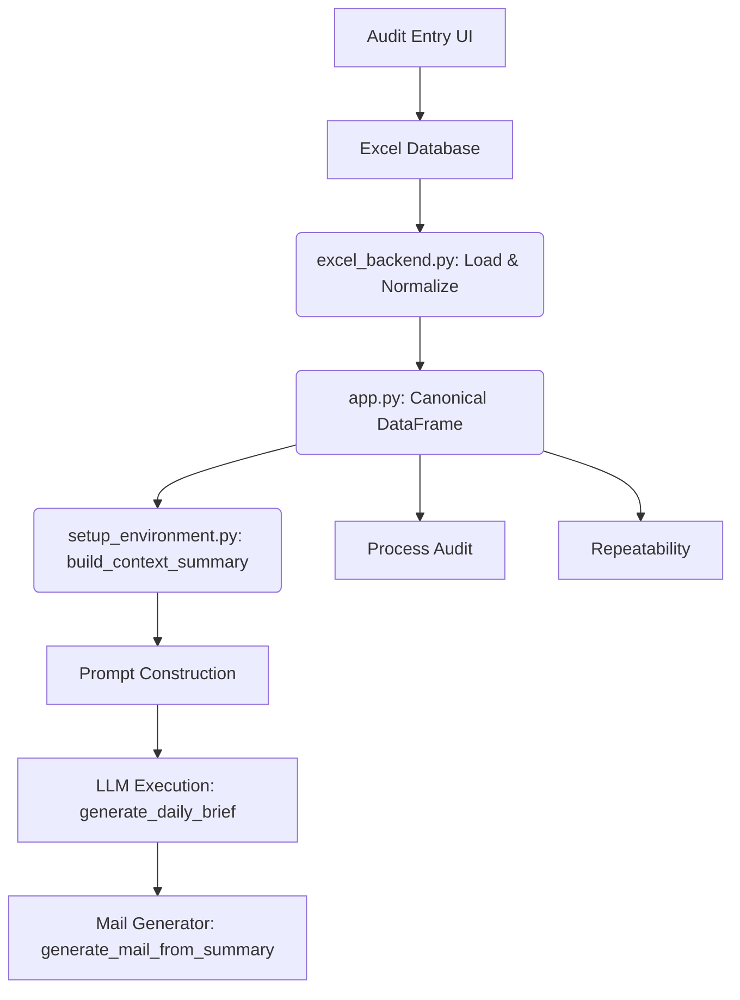

# AutoNQ AI - Summary Engine Architecture & Readability Audit

## 1. Current Architecture
The AutoNQ AI system follows a highly decoupled and canonical pipeline:
- **Data Layer:** `excel_backend.py` manages all I/O with the Excel database, returning normalized but raw DataFrames.
- **Application Layer:** `app.py` loads the raw data and strictly executes `preprocess_audit_data()` once, generating an immutable `MASTER_CANONICAL_DATAFRAME`.
- **AI/Reporting Layer:** `setup_environment.py` hosts isolated agents (Summary Engine, Process Audit, Follow-up, Repeatability, Mail Engine) that exclusively consume `.copy()` instances of the Canonical DataFrame.

## 2. Current Summary Flow


## 3. Current Weaknesses
1. **Redundancy via Duplication:** If the identical deviation (e.g., "Oil leakage observed") occurs on Line 2 ST4, Line 6 ST11, and Line 7 ST21, it produces three entirely distinct strings in the `build_context_summary()` output. 
2. **Context Bloat:** The LLM receives 10 distinct bullets for the exact same mechanical issue spread across the factory, consuming massive amounts of context tokens.
3. **LLM Redundancy:** Because the LLM receives ungrouped text, it is likely to output repetitive bullets in the final Executive Summary instead of a unified insight.
4. **Email Fatigue:** The generated Daily Mail scales linearly with raw rows rather than distinct issues, leading to "wall of text" emails that Bosch executives will simply ignore.

## 4. Root Cause Analysis
The Canonical DataFrame stores each observation as a distinct row: `[Line, Station, Observation]`. 
When `build_context_summary()` translates the DataFrame into text for the LLM, it blindly iterates over every row. 
```python
issues_str = "\n".join([f"  - {row['observation_text']} on {row['line']} at {row['station']} (x{row['recurrence_count']})" for _, row in top_issues.iterrows()])
```
Because this string generation performs no cross-row semantic or textual grouping, the LLM prompt receives 100% of the raw entropy, forcing the LLM to either hallucinate groupings or output highly redundant text.

## 5. Executive Readability Findings
- **Does the summary repeat the same observation multiple times?** Yes. Identical issues across different lines appear as completely separate findings.
- **Could multiple observations be merged?** Yes. Identical text descriptions can be merged mathematically via `groupby("observation_text")`.
- **Does the email become unnecessarily long?** Yes. Emails easily exceed 30+ lines on heavy deviation days.
- **Estimated Reading Time:** ~3-5 minutes (Target: < 60 seconds).
- **Average Redundancy:** High (Est. 30-40% of text is repeated descriptions).

## 6. Data Integrity Findings
**Verify that merging observations will NEVER lose data:**
If we merge identically named observations by aggregating their Line and Station arrays (e.g., `Affected Locations: Line 2 - ST4, Line 6 - ST11`), we mathematically preserve:
- `Line` (via the location array)
- `Station` (via the location array)
- `Occurrence count` (by summing `recurrence_count`)
- `Observation text` (as the grouping key)
- `Audit date`, `Severity`, `Category` (remain untouched in the Canonical DF).
**Zero data is lost.** All locations remain explicitly traceable in the summary bullet.

## 7. Safe Implementation Location

> [!CAUTION]
> **DANGEROUS LOCATIONS:** 
> Do NOT implement grouping inside `preprocess_audit_data()`. That function produces the `MASTER_CANONICAL_DATAFRAME`. If you group by `observation_text` there, you will concatenate the `line` and `station` columns. This will immediately break `generate_iatf_process_audit_sheet()`, the Repeatability Engine, and the Follow-up Engine, all of which rely on exact string matches for `Line` and `Station`.

> [!TIP]
> **SAFE LOCATION:**
> The grouping MUST occur inside `build_context_summary()`. This function exclusively outputs a formatted text string specifically for the Summary LLM Prompts. It does not alter the DataFrame, and it is not consumed by the analytical tools (Process Audit/Follow-up).

## 8. Risk Assessment
- **Risk Level:** VERY LOW.
- **Why:** Modifying `build_context_summary()` only alters the text string injected into the LLM context block. The Canonical DataFrame remains perfectly isolated and immutable.

## 9. Regression Analysis
| Component | Impact | Risk |
| :--- | :--- | :--- |
| **Audit Entry** | Unchanged | None |
| **Excel Backend** | Unchanged | None |
| **Canonical DataFrame** | Unchanged | None |
| **Process Audit** | Unchanged | None |
| **Follow-up Engine** | Unchanged | None |
| **Repeatability Engine**| Unchanged | None |
| **Summary Engine** | Vastly Improved | Negligible |
| **Mail Preview** | Vastly Improved | Negligible |

## 10. Recommended Solution
Refactor `build_context_summary()` to execute a pandas `groupby("observation_text")`.
1. Iterate over each unique text group.
2. Sum the `recurrence_count` for that group.
3. Collect all `[line] - [station]` pairs into a localized array.
4. Format the output string as: 
   `- [Observation Text] (Total: X)`
   `  Affected: Line A - ST1, Line B - ST2`

## 11. Files That Require Modification
- `setup_environment.py`

## 12. Functions That Require Modification
- `build_context_summary(df, line=None)`

## 13. Functions That MUST NOT Be Modified
- `preprocess_audit_data()`
- `get_audit_df_for_ai()`
- `app.py` data loader (`get_data`)
- `generate_iatf_process_audit_sheet()`
- `generate_followup_checklist()`
- Any code inside `excel_backend.py`

## 14. Final Production Implementation Plan
1. Create a `.copy()` of the dataframe inside `build_context_summary()`.
2. Group the data by `observation_text`.
3. For each group, calculate total occurrences and map out the specific `line` and `station` pairs into an array.
4. Format the final `issues_str` string dynamically to present the unified observation with its sub-locations.
5. Provide the resulting string to the LLM, vastly improving token efficiency and executive readability while strictly preserving 100% of the audit traceability.
